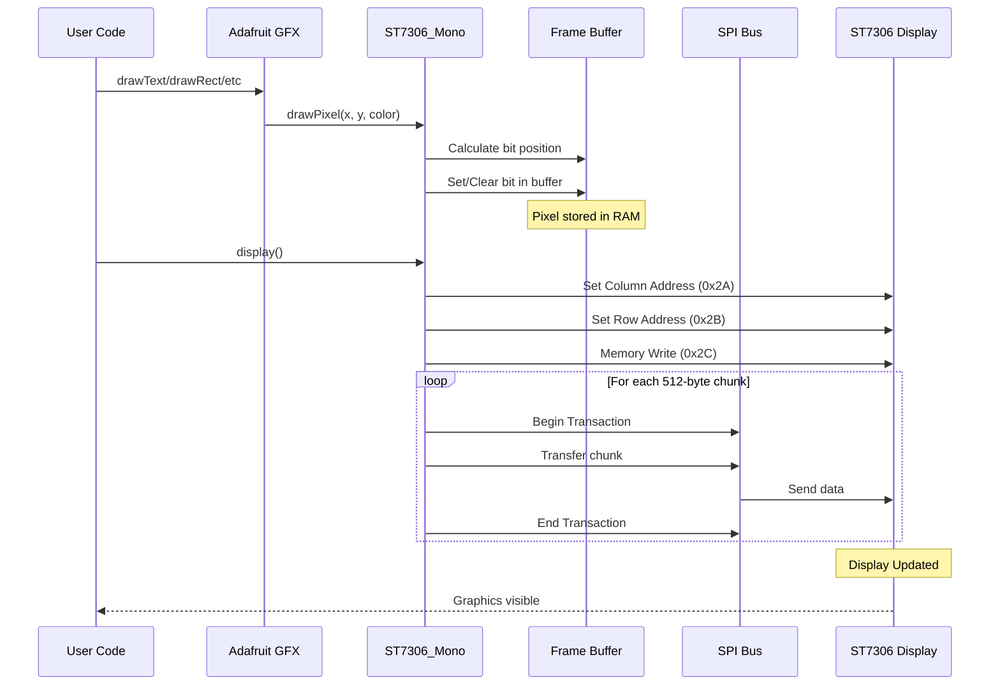
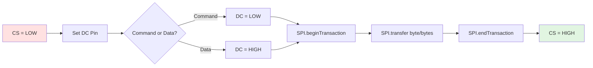
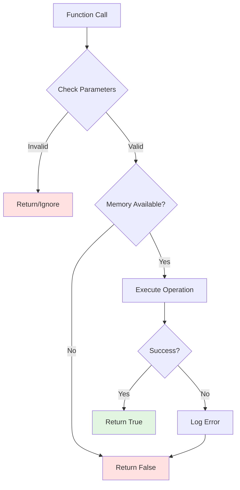

# ST7306 Display Logic Flow Diagram

## Complete System Flow

```mermaid
flowchart TD
    Start([Power On / Reset]) --> Init[Initialize Display Object<br/>ST7306_Mono display DC, RST, CS]
    Init --> BeginCall[Call display.begin]
    
    BeginCall --> AllocBuf{Allocate Frame Buffer<br/>15KB for 300x400 mono}
    AllocBuf -->|Failed| Error([Return False - Out of Memory])
    AllocBuf -->|Success| InitSPI[Initialize SPI<br/>40MHz, MSBFIRST, MODE0]
    
    InitSPI --> SetupGPIO[Setup GPIO Pins<br/>DC=OUTPUT<br/>CS=OUTPUT<br/>RST=OUTPUT]
    SetupGPIO --> HWReset[Hardware Reset Sequence]
    
    HWReset --> ResetHigh[RST = HIGH]
    ResetHigh --> Delay10[Wait 10ms]
    Delay10 --> ResetLow[RST = LOW]
    ResetLow --> Delay50[Wait 50ms]
    Delay50 --> ResetHigh2[RST = HIGH]
    ResetHigh2 --> Delay120[Wait 120ms]
    
    Delay120 --> InitSeq[Send ST7306 Init Commands]
    
    InitSeq --> OTPLoad[OTP Load Control 0xD6]
    OTPLoad --> AutoPwr[Auto Power Control 0xD1]
    AutoPwr --> GateV[Gate Voltage 0xC0]
    GateV --> VSH[VSH Setting 0xC1]
    VSH --> VSL[VSL Setting 0xC2]
    VSL --> VCOMH[VCOMH Setting 0xC4]
    VCOMH --> VCOML[VCOML Setting 0xC5]
    VCOML --> GateEQ[Gate EQ 0xB2]
    GateEQ --> SrcEQ[Source EQ 0xB3, 0xB4]
    SrcEQ --> OSC[OSC Setting 0xB7]
    OSC --> Duty[Duty Setting 0xB0]
    Duty --> SleepOut[Sleep Out 0x11]
    SleepOut --> Wait120[Wait 120ms]
    
    Wait120 --> MonoMode[Enable Monochrome Mode<br/>0xD8, 0x80, 0xE9]
    MonoMode --> ExtRes[External Resistor 0xC9]
    ExtRes --> MADCTL[Memory Access Control 0x36]
    MADCTL --> PixFmt[Pixel Format 0x3A = 0x00<br/>1-bit monochrome]
    PixFmt --> SrcSet[Source Setting 0xB9]
    SrcSet --> Panel[Panel Setting 0xB8]
    Panel --> TE[Enable Tearing Effect 0x35]
    TE --> AutoRead[Enable Auto Read 0xD0]
    AutoRead --> IdleOff[Idle Mode OFF 0x38]
    IdleOff --> DispOn[Display ON 0x29]
    
    DispOn --> ClearBuf[Clear Buffer to White 0xFF]
    ClearBuf --> FirstDisp[Send Initial Display]
    FirstDisp --> Ready([Ready for Graphics])
    
    Ready --> UserCode{User Application Code}
    
    UserCode --> DrawOp[Drawing Operations]
    
    DrawOp --> DrawPixel[drawPixel x, y, color]
    DrawPixel --> CalcByte[Calculate Byte Index<br/>byteIndex = y*300+x / 8]
    CalcByte --> CalcBit[Calculate Bit Position<br/>bitIndex = 7 - x*300+x % 8]
    CalcBit --> SetBit{Color?}
    SetBit -->|BLACK=0| ClearBit[buffer[byteIndex] &= ~1<<bitIndex]
    SetBit -->|WHITE=1| SetBitHigh[buffer[byteIndex] |= 1<<bitIndex]
    ClearBit --> NextDraw
    SetBitHigh --> NextDraw
    
    NextDraw{More Drawing?}
    NextDraw -->|Yes| DrawOp
    NextDraw -->|No| CallDisplay[Call display.display]
    
    CallDisplay --> SetWindow[Set Address Window<br/>0x2A: Col 0-299<br/>0x2B: Row 0-399]
    SetWindow --> MemWrite[Memory Write Command 0x2C]
    MemWrite --> SendLoop[Send Buffer in Chunks]
    
    SendLoop --> ChunkSize[Chunk = 512 bytes]
    ChunkSize --> DCHigh[DC = HIGH Data Mode]
    DCHigh --> CSLow[CS = LOW Select Device]
    CSLow --> SPIBegin[SPI.beginTransaction]
    SPIBegin --> TransferData[SPI.transfer buffer chunk]
    TransferData --> SPIEnd[SPI.endTransaction]
    SPIEnd --> CSHigh[CS = HIGH Deselect]
    
    CSHigh --> MoreChunks{More Buffer Data?}
    MoreChunks -->|Yes| SendLoop
    MoreChunks -->|No| DisplayDone([Display Updated])
    
    DisplayDone --> UserCode
    
    style Start fill:#e1f5e1
    style Ready fill:#e1f5e1
    style DisplayDone fill:#e1f5e1
    style Error fill:#ffe1e1
    style AllocBuf fill:#fff4e1
    style SetBit fill:#fff4e1
    style MoreChunks fill:#fff4e1
```

## Detailed Initialization Sequence

### Phase 1: Hardware Setup
```
1. Allocate 15KB frame buffer (300×400 ÷ 8)
2. Initialize SPI bus (40MHz, Mode 0)
3. Configure GPIO pins (DC, CS, RST)
4. Hardware reset sequence
```

### Phase 2: ST7306 Register Configuration
```
Command  | Register              | Purpose
---------|----------------------|--------------------------------
0xD6     | OTP Load             | Load factory calibration
0xD1     | Auto Power Control   | Power management
0xC0     | Gate Voltage         | Display driving voltage
0xC1     | VSH Setting          | High voltage levels
0xC2     | VSL Setting          | Low voltage levels
0xC4     | VCOMH Setting        | Common voltage high
0xC5     | VCOML Setting        | Common voltage low
0xB2     | Gate EQ              | Gate signal equalization
0xB3/B4  | Source EQ            | Source signal equalization
0xB7     | OSC Setting          | Internal oscillator
0xB0     | Duty Setting         | Display duty cycle
0x11     | Sleep Out            | Exit sleep mode
```

### Phase 3: Monochrome Configuration
```
Command  | Data    | Purpose
---------|---------|--------------------------------
0xD8     | 0x80    | Enable monochrome mode
         | 0xE9    | Monochrome parameters
0x36     | 0x48    | Memory access (MY=0, MX=1)
0x3A     | 0x00    | 1-bit pixel format
0x29     | -       | Display ON
```

## Graphics Rendering Pipeline



## Memory Layout

```
Frame Buffer Organization (15,000 bytes):
┌─────────────────────────────────────────────┐
│ Row 0: 300 pixels = 37.5 bytes (38 bytes)  │
│ Row 1: 300 pixels = 37.5 bytes (38 bytes)  │
│ Row 2: 300 pixels = 37.5 bytes (38 bytes)  │
│ ...                                         │
│ Row 399: 300 pixels = 37.5 bytes           │
└─────────────────────────────────────────────┘

Pixel Addressing:
Byte Index = (y × 300 + x) ÷ 8
Bit Index = 7 - ((y × 300 + x) mod 8)

Bit Value:
0 = Black pixel
1 = White pixel

Example for pixel (5, 10):
Byte = (10 × 300 + 5) ÷ 8 = 3005 ÷ 8 = 375
Bit = 7 - (3005 mod 8) = 7 - 5 = 2

buffer[375] bit 2 controls pixel (5, 10)
```

## SPI Transaction Details



## Timing Diagrams

### Hardware Reset Timing
```
RST  ────┐      ┌────────────────
         │      │
         └──────┘
         
Time:    10ms 50ms  120ms
         ↑    ↑     ↑
         │    │     └─ Display Ready
         │    └─ Reset Active
         └─ Pre-reset Stable
```

### SPI Command Transmission
```
CS   ────┐              ┌────
         └──────────────┘

DC   ─┐  ┌──────────────
      └──┘              

CLK  ┌─┐┌─┐┌─┐┌─┐┌─┐┌─┐
     └─┘└─┘└─┘└─┘└─┘└─┘

MOSI ─< D7 D6 D5 D4 D3...>─
```

## Performance Characteristics

| Operation | Time | Notes |
|-----------|------|-------|
| Hardware Reset | ~180ms | One-time at startup |
| Init Sequence | ~250ms | One-time at startup |
| Full Screen Refresh | ~100-150ms | 15,000 bytes @ 40MHz |
| drawPixel() | <1μs | Just updates RAM buffer |
| display() call | ~100ms | Transfers entire buffer |
| SPI Transaction | ~2.5μs/byte | At 40MHz |

## Error Handling Flow



## Best Practices

1. **Initialization**
   - Always check `begin()` return value
   - Call `begin()` only once
   - Allow time for reset sequence

2. **Drawing**
   - Batch all drawing operations
   - Call `display()` only when ready to update
   - Use clearDisplay() before redrawing entire screen

3. **Performance**
   - Minimize `display()` calls (each takes ~100ms)
   - Use partial updates if only changing small areas
   - Pre-calculate positions when possible

4. **Memory**
   - 15KB buffer is allocated on heap
   - Check available RAM before begin()
   - Free buffer in destructor if needed
