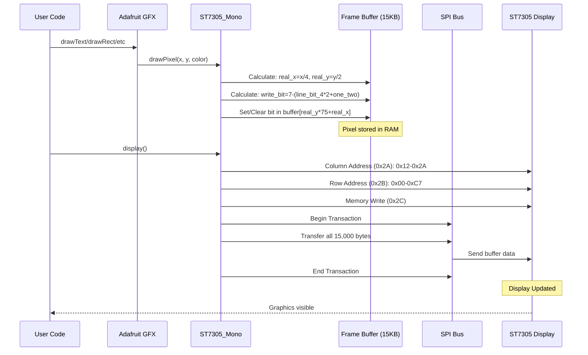
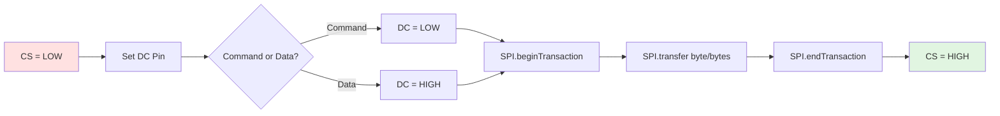
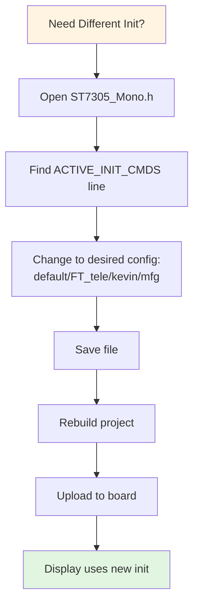
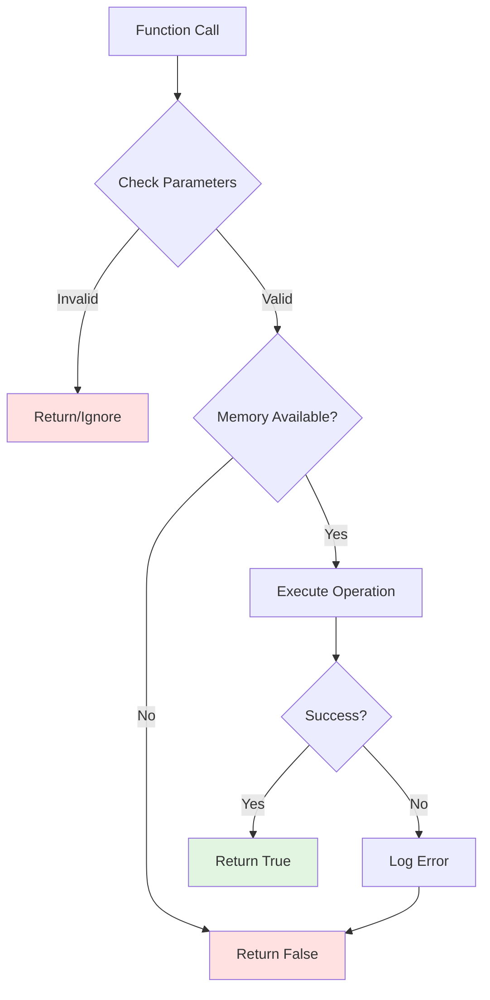
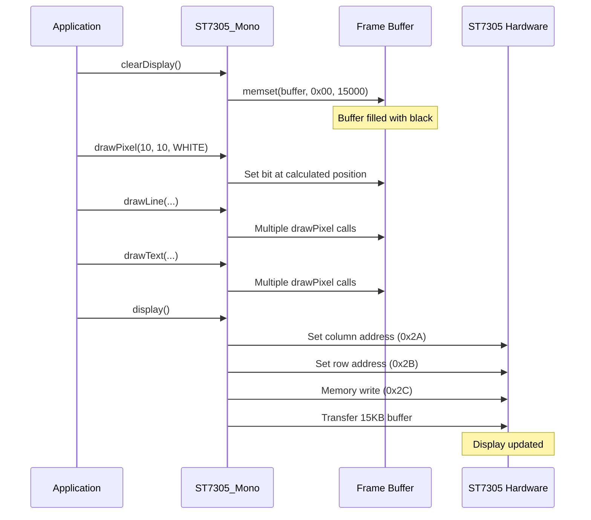
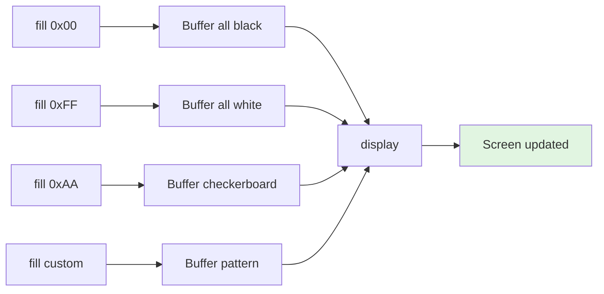

# ST7305 Display Logic Flow Diagram

## Complete System Flow

```mermaid
flowchart TD
    Start([Power On / Reset]) --> Init[Initialize Display Object<br/>ST7305_Mono display DC, RST, CS]
    Init --> BeginCall[Call display.begin freq]
    
    BeginCall --> AllocBuf{Allocate Frame Buffer<br/>15KB for 300x400 mono}
    AllocBuf -->|Failed| Error([Return False - Out of Memory])
    AllocBuf -->|Success| InitSPI[Initialize SPI<br/>1MHz or 40MHz, MSBFIRST, MODE0]
    
    InitSPI --> SetupGPIO[Setup GPIO Pins<br/>DC=OUTPUT<br/>CS=OUTPUT<br/>RST=OUTPUT]
    SetupGPIO --> HWReset[Hardware Reset Sequence]
    
    HWReset --> ResetHigh[RST = HIGH]
    ResetHigh --> Delay10[Wait 10ms]
    Delay10 --> ResetLow[RST = LOW]
    ResetLow --> Delay50[Wait 50ms]
    Delay50 --> ResetHigh2[RST = HIGH]
    ResetHigh2 --> Delay120[Wait 120ms]
    
    Delay120 --> InitSeq[Send ST7305 Init Commands<br/>From ACTIVE_INIT_CMDS]
    
    InitSeq --> LoadCmds[Load Command Array<br/>default/FT_tele/kevin/mfg]
    LoadCmds --> SendLoop[Iterate Through Commands]
    
    SendLoop --> SendCmd[Send Command Byte]
    SendCmd --> HasData{Has Data?}
    HasData -->|Yes| SendData[Send Data Bytes]
    HasData -->|No| NextCmd
    SendData --> HasDelay{Has Delay?}
    HasDelay -->|Yes| DoDelay[Wait delay_ms]
    HasDelay -->|No| NextCmd
    DoDelay --> NextCmd
    
    NextCmd{More Commands?}
    NextCmd -->|Yes| SendLoop
    NextCmd -->|No| ClearBuf[Clear Buffer to Black 0x00]
    ClearBuf --> FirstDisp[Send Initial Display]
    FirstDisp --> Ready([Ready for Graphics])
    
    Ready --> UserCode{User Application Code}
    
    UserCode --> DrawOp[Drawing Operations]
    
    DrawOp --> DrawPixel[drawPixel x, y, color]
    DrawPixel --> CalcReal[Calculate Real Position<br/>real_x = x / 4<br/>real_y = y / 2]
    CalcReal --> CalcBit[Calculate Bit Position<br/>line_bit_4 = x % 4<br/>one_two = y % 2<br/>write_bit = 7 - line_bit_4*2+one_two]
    CalcBit --> CalcByte[Calculate Byte Index<br/>byteIndex = real_y * 75 + real_x]
    CalcByte --> SetBit{Color?}
    SetBit -->|BLACK=0| ClearBit[buffer[byteIndex] &= ~1<<write_bit]
    SetBit -->|WHITE=1| SetBitHigh[buffer[byteIndex] |= 1<<write_bit]
    ClearBit --> NextDraw
    SetBitHigh --> NextDraw
    
    NextDraw{More Drawing?}
    NextDraw -->|Yes| DrawOp
    NextDraw -->|No| CallDisplay[Call display.display]
    
    CallDisplay --> SetColAddr[Set Column Address 0x2A<br/>Start: 0x12, End: 0x2A]
    SetColAddr --> SetRowAddr[Set Row Address 0x2B<br/>Start: 0x00, End: 0xC7]
    SetRowAddr --> MemWrite[Memory Write Command 0x2C]
    MemWrite --> SendBuf[Send Entire Buffer via SPI]
    
    SendBuf --> DCHigh[DC = HIGH Data Mode]
    DCHigh --> CSLow[CS = LOW Select Device]
    CSLow --> SPIBegin[SPI.beginTransaction]
    SPIBegin --> TransferAll[SPI.transfer buffer, 15000]
    TransferAll --> SPIEnd[SPI.endTransaction]
    SPIEnd --> CSHigh[CS = HIGH Deselect]
    
    CSHigh --> DisplayDone([Display Updated])
    
    DisplayDone --> UserCode
    
    style Start fill:#e1f5e1
    style Ready fill:#e1f5e1
    style DisplayDone fill:#e1f5e1
    style Error fill:#ffe1e1
    style AllocBuf fill:#fff4e1
    style SetBit fill:#fff4e1
    style NextCmd fill:#fff4e1
```

## Detailed Initialization Sequence

### Phase 1: Hardware Setup
```
1. Allocate 15KB frame buffer: (300/4) × (400/2) = 15,000 bytes
2. Initialize SPI bus (1MHz default, 40MHz optional, Mode 0)
3. Configure GPIO pins (DC, CS, RST)
4. Hardware reset sequence:
   - RST HIGH → wait 10ms → RST LOW → wait 50ms → RST HIGH → wait 120ms
```

### Phase 2: ST7305 Command Array Configuration
The library supports multiple init command configurations via `ACTIVE_INIT_CMDS` macro:

```cpp
// Command structure
typedef struct {
    uint8_t cmd;              // Command byte
    uint8_t data[10];         // Up to 10 data bytes
    uint8_t len;              // Number of data bytes
    uint16_t delay_ms;        // Delay after command (ms)
} st7305_lcd_init_cmd_t;
```

**Available Configurations**:
- `st7305_init_cmds_default` - Standard initialization
- `st7305_init_cmds_FT_tele` - FT_tele reference implementation
- `st7305_init_cmds_kevin` - Custom configuration
- `st7305_init_cmds_mfg` - Manufacturer settings

**Switching**: Edit `ACTIVE_INIT_CMDS` in ST7305_Mono.h

### Phase 3: Initialization Command Execution
```
For each command in ACTIVE_INIT_CMDS array:
1. Send command byte (DC=LOW)
2. Send data bytes if len > 0 (DC=HIGH)
3. Delay for delay_ms if > 0
4. Repeat for all commands in array
```

## Graphics Rendering Pipeline



## Memory Layout

```
Frame Buffer Organization (15,000 bytes):

Total = (WIDTH / 4) × (HEIGHT / 2)
     = (300 / 4) × (400 / 2)
     = 75 bytes/row × 200 row-pairs
     = 15,000 bytes

┌─────────────────────────────────────────────┐
│ Row-pair 0 (rows 0-1): 75 bytes            │
│ Row-pair 1 (rows 2-3): 75 bytes            │
│ Row-pair 2 (rows 4-5): 75 bytes            │
│ ...                                         │
│ Row-pair 199 (rows 398-399): 75 bytes      │
└─────────────────────────────────────────────┘

Horizontal Layout (4 pixels per byte):
┌───────┬───────┬───────┬───────┬───────┬─────┐
│ Byte 0│ Byte 1│ Byte 2│ Byte 3│  ...  │Byte74│
│ px0-3 │ px4-7 │ px8-11│px12-15│       │px296-299│
└───────┴───────┴───────┴───────┴───────┴─────┘

Vertical Layout (2 rows per group):
Each byte contains bits for:
- Row N (even y)
- Row N+1 (odd y)

Pixel Addressing Formula:
real_x = x / 4                    # Which byte horizontally
real_y = y / 2                    # Which row-pair
line_bit_4 = x % 4                # Which of 4 pixels in byte
one_two = y % 2                   # Which of 2 rows in pair
write_bit = 7 - (line_bit_4 * 2 + one_two)  # Final bit position
byteIndex = real_y * 75 + real_x  # Buffer index

Bit Value:
0 = Black pixel
1 = White pixel
```

## Pixel Mapping Example

**Example 1: Pixel (5, 10)**
```
x = 5, y = 10

Step 1: Calculate byte position
real_x = 5 / 4 = 1
real_y = 10 / 2 = 5
byteIndex = 5 * 75 + 1 = 376

Step 2: Calculate bit position
line_bit_4 = 5 % 4 = 1
one_two = 10 % 2 = 0
write_bit = 7 - (1 * 2 + 0) = 5

Result: buffer[376] bit 5 controls pixel (5, 10)
```

**Example 2: Pixel (0, 0)**
```
x = 0, y = 0

real_x = 0 / 4 = 0
real_y = 0 / 2 = 0
byteIndex = 0 * 75 + 0 = 0
line_bit_4 = 0 % 4 = 0
one_two = 0 % 2 = 0
write_bit = 7 - (0 * 2 + 0) = 7

Result: buffer[0] bit 7 controls pixel (0, 0)
```

**Example 3: Pixel (3, 1)**
```
x = 3, y = 1

real_x = 3 / 4 = 0
real_y = 1 / 2 = 0
byteIndex = 0 * 75 + 0 = 0
line_bit_4 = 3 % 4 = 3
one_two = 1 % 2 = 1
write_bit = 7 - (3 * 2 + 1) = 0

Result: buffer[0] bit 0 controls pixel (3, 1)
```

## Byte-Level Bit Mapping

```
Single byte contains 4 horizontal pixels across 2 vertical rows:

Bit:  7    6    5    4    3    2    1    0
     ┌────┬────┬────┬────┬────┬────┬────┬────┐
     │x+0 │x+0 │x+1 │x+1 │x+2 │x+2 │x+3 │x+3 │
     │y+0 │y+1 │y+0 │y+1 │y+0 │y+1 │y+0 │y+1 │
     └────┴────┴────┴────┴────┴────┴────┴────┘

Where:
- x is the base x coordinate (0, 4, 8, 12, ...)
- y is the base y coordinate (0, 2, 4, 6, ...)
```

## SPI Transaction Details



### Display Update SPI Sequence
```
1. writeCommand(0x2A)           # Column address
2. writeData(0x12, 0x2A)        # Range: 0x12 to 0x2A
3. writeCommand(0x2B)           # Row address
4. writeData(0x00, 0xC7)        # Range: 0x00 to 0xC7
5. writeCommand(0x2C)           # Memory write
6. DC=HIGH, CS=LOW
7. SPI.beginTransaction()
8. SPI.transfer(buffer, 15000)  # Send all 15KB
9. SPI.endTransaction()
10. CS=HIGH
```

## Timing Diagrams

### Hardware Reset Timing
```
RST  ────┐      ┌────────────────
         │      │
         └──────┘
         
Time:    10ms 50ms  120ms
         ↑    ↑     ↑
         │    │     └─ Display Ready
         │    └─ Reset Active (LOW)
         └─ Pre-reset Stable (HIGH)
```

### SPI Command Transmission
```
CS   ────┐              ┌────
         └──────────────┘

DC   ─┐  ┌──────────────      (LOW=Command, HIGH=Data)
      └──┘              

CLK  ┌─┐┌─┐┌─┐┌─┐┌─┐┌─┐
     └─┘└─┘└─┘└─┘└─┘└─┘

MOSI ─< D7 D6 D5 D4 D3...>─
```

## Performance Characteristics

| Operation | Time | Notes |
|-----------|------|-------|
| Hardware Reset | ~180ms | One-time at startup |
| Init Sequence | ~250ms | One-time, varies by config |
| Full Screen Refresh | ~100-150ms | 15,000 bytes @ 40MHz |
| Full Screen Refresh | ~300ms | 15,000 bytes @ 1MHz |
| drawPixel() | <1μs | Only updates RAM buffer |
| display() call | ~100ms @ 40MHz | Transfers entire buffer |
| display() call | ~300ms @ 1MHz | Transfers entire buffer |
| SPI Transaction | ~2.5μs/byte @ 40MHz | Hardware SPI |
| SPI Transaction | ~10μs/byte @ 1MHz | Hardware SPI |

## Configuration Switching Workflow



Example:
```cpp
// In ST7305_Mono.h, change from:
#define ACTIVE_INIT_CMDS st7305_init_cmds_default

// To:
#define ACTIVE_INIT_CMDS st7305_init_cmds_FT_tele
```

## Error Handling Flow



## Common Operations Flow

### Draw and Display Workflow


### Fill Screen Workflow


## Best Practices

### 1. Initialization
```cpp
✓ GOOD:
if (!display.begin(1000000)) {
    Serial.println("Init failed!");
    while(1);  // Stop on failure
}

✗ BAD:
display.begin();  // Ignoring return value
```

### 2. Drawing Operations
```cpp
✓ GOOD (Batch operations):
display.clearDisplay();
for (int i = 0; i < 100; i++) {
    display.drawPixel(i, 10, ST7305_WHITE);
}
display.display();  // Single update

✗ BAD (Multiple updates):
for (int i = 0; i < 100; i++) {
    display.drawPixel(i, 10, ST7305_WHITE);
    display.display();  // 100 full screen updates!
}
```

### 3. Color Usage
```cpp
✓ GOOD:
display.drawLine(0, 0, 100, 100, ST7305_WHITE);  // Visible on black background

✗ BAD:
display.drawLine(0, 0, 100, 100, ST7305_BLACK);  // Invisible on black background
```

### 4. Memory Management
```cpp
✓ GOOD:
if (!display.begin()) {
    Serial.println("Out of memory!");
    // Handle error
}

✗ BAD:
display.begin();
// Assume success, may crash if out of RAM
```

### 5. Configuration Changes
```cpp
✓ GOOD:
// In ST7305_Mono.h
#define ACTIVE_INIT_CMDS st7305_init_cmds_FT_tele
// Single point of change

✗ BAD:
// Modifying multiple places in code
// Error-prone and hard to maintain
```

## Debugging Techniques

### Issue: Nothing on Display
```
1. Check clearDisplay() → should fill with 0x00 (black)
2. Verify drawing with ST7305_WHITE (not BLACK)
3. Ensure display() is called after drawing
4. Check SPI connections and pin definitions
5. Try lower SPI speed: begin(1000000)
```

### Issue: Garbled Display
```
1. Verify correct buffer size: 15,000 bytes
2. Check available RAM (Serial.print("Free RAM: "); Serial.println(freeMemory());)
3. Try different init config via ACTIVE_INIT_CMDS
4. Verify SPI mode and frequency
5. Check for buffer overflows in drawing code
```

### Issue: Slow Updates
```
1. Increase SPI speed: begin(40000000)
2. Minimize display() calls - batch drawing
3. Profile code to find bottlenecks
4. Avoid unnecessary clearDisplay() calls
```

## Advanced Customization

### Creating Custom Init Commands
```cpp
// In ST7305_Mono.h
static const st7305_lcd_init_cmd_t st7305_init_cmds_mycustom[] = {
    {0x11, {}, 0, 120},                    // Sleep out
    {0x36, {0x00}, 1, 0},                  // Memory access control
    {0x3A, {0x00}, 1, 0},                  // Pixel format
    {0x29, {}, 0, 0},                      // Display on
};

static const int st7305_init_cmds_mycustom_count = 
    sizeof(st7305_init_cmds_mycustom) / sizeof(st7305_lcd_init_cmd_t);

// Then in same file:
#define ACTIVE_INIT_CMDS st7305_init_cmds_mycustom
```

### Direct Buffer Manipulation
```cpp
// Get buffer pointer
uint8_t* buf = display.getBuffer();

// Manually set pixels (ADVANCED - use with caution)
// Calculate position: real_y * 75 + real_x
buf[0] |= (1 << 7);  // Set pixel (0,0) to white

// Always call display() to update screen
display.display();
```

## Summary

The ST7305 display driver provides:
- **15KB frame buffer** with efficient 4-pixel-per-byte layout
- **Flexible configuration** via single-point ACTIVE_INIT_CMDS switching
- **Fast SPI communication** up to 40MHz
- **Full Adafruit GFX compatibility** for rich graphics
- **Simple API** with clear initialization and drawing workflow
- **Multiple init configurations** for different display requirements

Key formula for pixel mapping:
```
write_bit = 7 - ((x % 4) * 2 + (y % 2))
byteIndex = (y / 2) * 75 + (x / 4)
```

Remember:
- Use `ST7305_WHITE` for visible drawing on black background
- Batch drawing operations before calling `display()`
- Switch init configs by changing one line in header file
- 15KB buffer = (300/4) × (400/2) = 75 × 200
